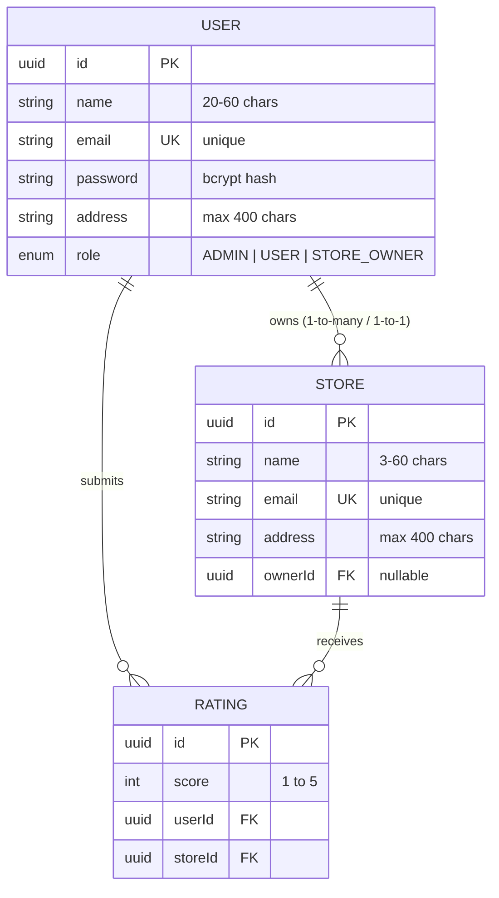
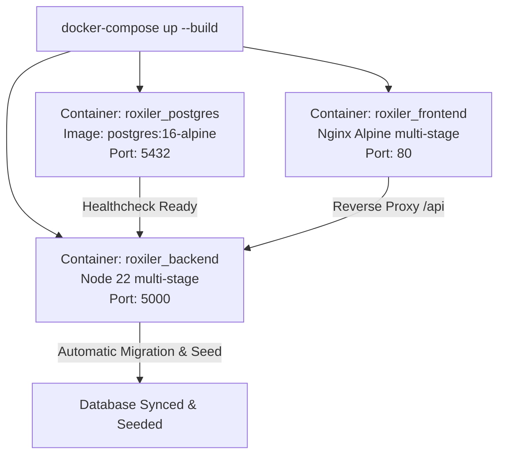

# 🎓 Roxiler Store Rating Platform: Architecture & Viva Guide

> **Purpose**: This guide is designed to help you thoroughly understand every single layer, architectural decision, data flow, testing strategy, and code pattern used in this project. Use this for quick revision, deep understanding, and acing technical interviews or viva examinations.

---

## 📑 Table of Contents
1. [30-Second Elevator Pitch](#1-30-second-elevator-pitch)
2. [Tech Stack: The "Why" & The "How"](#2-tech-stack-the-why--the-how)
3. [System Architecture & Request Lifecycle](#3-system-architecture--request-lifecycle)
4. [Database Design & Unique Constraints](#4-database-design--unique-constraints)
5. [Deep Dive into Testing (How & Why)](#5-deep-dive-into-testing-how--why)
6. [Security & Validation Strategy](#6-security--validation-strategy)
7. [Docker & Deployment Pipeline](#7-docker--deployment-pipeline)
8. [Top 20 Viva & Interview Questions with Model Answers](#8-top-20-viva--interview-questions-with-model-answers)

---

## 1. 30-Second Elevator Pitch

> *"If an interviewer asks: 'Can you briefly explain your project?'"*

**Say this:**
> *"The project is a multi-role Store Rating and Analytics web application built with a React TypeScript frontend, an Express TypeScript backend, and a PostgreSQL database managed through Prisma ORM.*
>
> *It supports three distinct user roles under a single unified authentication system:*
> 1. ***System Administrator***: *Can view platform KPIs, manage/filter/sort all users and stores, register new stores, and create users with custom roles.*
> 2. ***Store Owner***: *Has a dedicated merchant dashboard displaying their store's calculated average rating, a 1-to-5 star breakdown, and a searchable/sortable list of all customers who rated their store.*
> 3. ***Normal User***: *Can sign up, browse stores with search and multi-criteria sorting, and submit or modify ratings on a 1-to-5 star scale.*
>
> *The system strictly enforces custom validation rules (such as 20–60 character names and complex passwords), features automated Jest tests, provides interactive OpenAPI/Swagger documentation, and is fully containerized with Docker Compose for one-command deployment."*

---

## 2. Tech Stack: The "Why" & The "How"

### A. Backend: Express.js + TypeScript
* **Why not plain JavaScript?**
  * Plain JS leads to runtime crashes due to undefined properties or mismatched types. TypeScript provides **compile-time type safety**, interfaces, and auto-completion, which eliminates entire classes of bugs.
* **Why Express instead of NestJS or Loopback?**
  * Express is lightweight, flexible, and has minimal abstraction overhead. To maintain enterprise standards without NestJS boilerplate, we structured Express into a **Clean Layered Architecture** (`routes -> middlewares -> controllers -> services/prisma`).
* **Key packages used:**
  * `bcryptjs`: Industry standard one-way password hashing with salt rounds.
  * `jsonwebtoken (JWT)`: Stateless session authorization via signed tokens.
  * `zod`: Declarative runtime schema validation that matches TypeScript types.
  * `helmet`: Sets HTTP security headers (prevents clickjacking, MIME sniffing).
  * `cors`: Cross-Origin Resource Sharing control.
  * `swagger-ui-express` & `swagger-jsdoc`: Serves interactive documentation at `/api/docs`.

### B. Database: PostgreSQL + Prisma ORM
* **Why PostgreSQL?**
  * PostgreSQL is an ACID-compliant relational database. Ratings, users, and stores have strict relational dependencies (foreign keys, cascading rules, and unique compound constraints).
* **Why Prisma ORM instead of raw SQL or TypeORM/Mongoose?**
  1. **Schema-as-Code**: You write the schema once in `schema.prisma`.
  2. **Type-Safe Client**: Prisma generates a custom TypeScript client (`@prisma/client`) reflecting the exact database tables. If you query a field that doesn't exist, TypeScript gives a compile error.
  3. **Auto-Migrations & Seeding**: Database creation and dummy data loading can be executed programmatically.

### C. Frontend: React 18 + Vite + TypeScript + Tailwind CSS
* **Why Vite instead of Create React App (CRA)?**
  * CRA uses Webpack, which is slow and officially deprecated. Vite uses native ES modules during development, resulting in sub-second cold server starts and instant Hot Module Replacement (HMR).
* **Why Tailwind CSS?**
  * Zero runtime overhead (compiles only used CSS utilities), rapid UI iteration, built-in responsive design prefixes (`sm:`, `md:`, `lg:`), and seamless dark mode toggling using the `dark:` selector.
* **Why Recharts?**
  * Native React declarative SVG chart library. Perfect for displaying the Admin rating distribution and Store Owner analytics without loading heavy canvas engines.

---

## 3. System Architecture & Request Lifecycle

```
[ Browser / Client ]
        │  1. HTTP Request (e.g. POST /api/ratings with Bearer JWT)
        ▼
[ Express Server ]
        │  2. Global Middlewares: Helmet (Security) + CORS + JSON Body Parser
        ▼
[ Route Matcher: /api/ratings ]
        │  3. auth.middleware.ts: Extracts token, verifies with JWT_SECRET
        │     -> Injects decoded payload into `req.user`
        ▼
[ Role Guard: requireNormalUser ]
        │  4. role.middleware.ts: Checks if `req.user.role === 'USER'`
        │     -> If not, throws 403 Forbidden
        ▼
[ Validation Middleware: validateBody(SubmitRatingSchema) ]
        │  5. validate.middleware.ts: Zod checks score is integer 1..5, storeId is UUID
        │     -> If invalid, returns 400 Bad Request with field errors
        ▼
[ RatingController.submitOrUpdateRating ]
        │  6. Business Logic: Executes Prisma upsert on Rating table
        │     -> Recalculates store overall average rating
        ▼
[ Database: PostgreSQL ]
        │  7. Commits row inside transaction; guarantees unique (userId, storeId)
        ▼
[ HTTP 200 Response ]
        │  8. Returns JSON with updated store average & user rating
```

---

## 4. Database Design & Unique Constraints

### The Relational Schema


### The Critical Unique Constraint: `@@unique([userId, storeId])`
* **Why is this so important?**
  * The challenge requirement states: *A user can submit a rating (1 to 5) or modify their existing rating.*
  * By placing a compound unique index on `[userId, storeId]`, the database guarantees that a single user cannot submit duplicate rating rows for the same store.
  * In the backend, we use Prisma's `upsert`:
    ```ts
    prisma.rating.upsert({
      where: {
        userId_storeId: { userId, storeId }
      },
      update: { score }, // If already rated, modify
      create: { userId, storeId, score } // If first time, insert
    })
    ```
  * This is clean, atomic, prevents race conditions, and eliminates duplicate rows without complex manual SQL queries.

---

## 5. Deep Dive into Testing (How & Why)

### How Testing is Structured
We use **Jest** as the test runner and **Supertest** to simulate HTTP requests against the Express app without needing a running server port.

Test file: [`backend/src/__tests__/app.test.ts`](file:///d:/work/Projects/Roxiler%20System%20Assignment/backend/src/__tests__/app.test.ts)

### What We Test & Why:
1. **Name Validation Rules (Min 20, Max 60)**:
   * Test: Short name (`"Short Name"`) ➡️ Rejected (`success: false`).
   * Test: Valid name (`"Alexander Hamilton Junior"`) ➡️ Accepted (`success: true`).
   * Test: Over 60 characters ➡️ Rejected.
   * *Why?* Ensures edge cases don't bypass the server even if client-side validation is skipped.

2. **Password Complexity**:
   * Test: Missing uppercase (`"secret@123"`) ➡️ Rejected.
   * Test: Missing special character (`"SecretPass123"`) ➡️ Rejected.
   * Test: Length < 8 or > 16 ➡️ Rejected.
   * Test: Compliant password (`"SecureP@ss123"`) ➡️ Accepted.

3. **Role-Based Security Guards**:
   * Test: Accessing `/api/admin/dashboard` without Bearer token ➡️ `401 Unauthorized`.
   * Test: Submitting a rating (`POST /api/ratings`) without authentication ➡️ `401 Unauthorized`.

4. **Service Health Check**:
   * Test: `GET /api/health` ➡️ `200 OK` with `{ status: "healthy" }`.

### How to run tests:
```bash
cd backend
npm test
```
*Result: 11 passing tests in under 10 seconds.*

---

## 6. Security & Validation Strategy

### Dual-Layer Validation (Defense in Depth)
* **Layer 1: Client-Side (React)**
  * Instant feedback for user experience.
  * Real-time character counters (`18/60 min 20 required`).
  * Live password checklist with visual checkmarks (`8-16 chars`, `1+ uppercase`, `1+ special char`).
* **Layer 2: Server-Side (Zod Middleware)**
  * The true security barrier. Even if someone uses Postman or cURL to bypass the React frontend, the server parses the payload using `validators/index.ts` and aborts with a clean `400 Bad Request` before reaching database queries.

### Password Storage Security
* Raw passwords are **NEVER** stored.
* Before writing to the database:
  ```ts
  const salt = await bcrypt.genSalt(10);
  const hashedPassword = await bcrypt.hash(rawPassword, salt);
  ```
* Salt rounds = 10 provides strong resistance against brute-force and rainbow table attacks.

---

## 7. Docker & Deployment Pipeline

### How the Docker Stack Works:


1. **PostgreSQL Container**: Boots up and runs a healthcheck (`pg_isready`).
2. **Backend Container**: Waits for PostgreSQL to be healthy, automatically runs `prisma db push` and `prisma/seed.ts`, then starts the Express API on port 5000.
3. **Frontend Container**: Compiles the React Vite bundle in a builder stage, copies static assets to Nginx, and proxies `/api` calls to the backend on port 80.

---

## 8. Top 20 Viva & Interview Questions with Model Answers

### Q1: Can you walk me through the authentication and authorization mechanism?
**Answer:**
> *"We implemented a stateless JWT (JSON Web Token) authentication architecture. When a user logs in via `/api/auth/login`, we verify their email and compare the bcrypt password hash. Upon success, we generate a signed JWT containing `{ id, email, name, role }` with a 7-day expiration.*
>
> *On subsequent requests, the frontend sends this token in the `Authorization: Bearer <token>` header. Our `auth.middleware.ts` decodes the token and attaches `req.user`. Then, role guard middlewares (like `requireAdmin` or `requireNormalUser`) verify if `req.user.role` has the required privilege. If not, a `403 Forbidden` error is returned."*

---

### Q2: How did you implement the requirement that users can both submit and modify their ratings?
**Answer:**
> *"In PostgreSQL, we enforced a compound unique index on `[userId, storeId]` in the `Rating` table. In our `RatingController`, we used Prisma's `upsert()` method. If a rating record with the given `userId` and `storeId` already exists, Prisma executes an SQL `UPDATE` on the `score` column. If no record exists, it executes an SQL `INSERT`.*
>
> *Immediately following the upsert, we query the store's ratings to compute the updated average score and return both the user's rating and the new store average in one atomic request."*

---

### Q3: Why did you validate input on both the frontend and backend? Isn't frontend validation enough?
**Answer:**
> *"No, frontend validation is purely for User Experience (giving instant feedback and preventing accidental errors), but it provides zero security. Anyone can bypass the frontend using Postman, cURL, or developer tools to send arbitrary payloads directly to the API.*
>
> *Backend validation using Zod is the authoritative defense line that guarantees data integrity and prevents malformed data or injection attacks from ever reaching our database."*

---

### Q4: Why did you pick Prisma ORM over raw SQL queries?
**Answer:**
> *"While raw SQL is powerful, Prisma offers three massive advantages for enterprise applications:*
> 1. *Type Safety: Prisma automatically generates TypeScript interfaces from our schema. If an attribute name changes, TypeScript flags errors across our codebase at compile time.*
> 2. *Security: Prisma uses parameterized queries under the hood, making SQL injection attacks virtually impossible.*
> 3. *Productivity: Prisma simplifies migrations, seeding, relations, and compound unique constraints with clean declarative syntax."*

---

### Q5: What is the purpose of salting when hashing passwords with bcrypt?
**Answer:**
> *"Hashing alone is deterministic (the same password always yields the same hash), making it vulnerable to precomputed dictionary attacks known as Rainbow Tables.*
>
> *Salting injects a cryptographically random string into the password before hashing. This ensures that two users with the exact same password will have completely different hashes in the database, nullifying rainbow table attacks."*

---

### Q6: How does sorting and filtering work in your tables?
**Answer:**
> *"We implemented a generic, reusable `DataTable` component. When a user clicks a column header (e.g., Name, Email, Address, Rating, Role), it toggles between `asc` and `desc` order.*
>
> *The frontend sends these as query parameters (`?sortBy=name&sortOrder=asc&search=keyword&role=USER`) to the backend. The backend controller dynamically constructs Prisma's `where` filters (using case-insensitive `contains`) and sorts the records before applying pagination."*

---

### Q7: How does the Store Owner dashboard calculate its metrics?
**Answer:**
> *"When a store owner logs in, the backend identifies their assigned store via their `ownerId` foreign key. It aggregates all ratings linked to that store to calculate:*
> 1. *Total Reviewers count.*
> 2. *Mathematical Average Rating (`sum(score) / count(ratings)`).*
> 3. *Score Distribution: grouped counts for 1, 2, 3, 4, and 5 stars to calculate percentage progress bars.*
> 4. *A detailed list of the reviewers' details (Name, Email, Address, Rating, Date) with full search and sorting capability."*

---

### Q8: What happens if a user is a Store Owner on the Admin user list?
**Answer:**
> *"As specifically required by the challenge, when the System Administrator views the user list, if any user has the role `STORE_OWNER`, our backend queries their assigned store and dynamically computes and returns their store's average rating alongside their profile. If the user is a Normal User or Admin, it displays `N/A`."*

---

### Q9: How do you handle errors centrally in Express?
**Answer:**
> *"Instead of using messy try-catch blocks everywhere that manually craft error responses, we created a custom `ApiError` class extending `Error` with `statusCode` and `errors` array.*
>
> *All controllers pass errors to `next(error)`, which triggers our global `error.middleware.ts`. This middleware handles custom `ApiError` instances, Zod validation errors, and Prisma unique constraint violations (P2002), returning uniform JSON responses with appropriate HTTP status codes (400, 401, 403, 404, 409, 500)."*

---

### Q10: What is the difference between HTTP 401 and HTTP 403 status codes?
**Answer:**
> - *`401 Unauthorized`: Authentication is missing or invalid (e.g., no Bearer token provided, or token expired).*
> - *`403 Forbidden`: Authentication succeeded, but the user does not have permission for the requested resource (e.g., a Normal User trying to access `/api/admin/users`)."*

---

### Q11: How does your React application maintain authentication across page refreshes?
**Answer:**
> *"In `AuthContext.tsx`, when a user logs in, we persist the JWT token and user profile in `localStorage`. On app mount, `AuthContext` initializes with this cached data and immediately calls `/api/auth/me` to validate the token against the backend. If the token has expired, Axios interceptors detect the 401 response, wipe the invalid token, and smoothly redirect the user to `/login`."*

---

### Q12: How did you implement Dark Mode?
**Answer:**
> *"We implemented a custom `ThemeContext` that checks user preference (either saved in `localStorage` or matching the OS via `prefers-color-scheme`). It toggles the `'dark'` class on the root `<html>` tag.*
>
> *In Tailwind, we configured `darkMode: 'class'`, enabling clean, responsive styling such as `bg-white dark:bg-slate-900` across all cards, modals, and typography."*

---

### Q13: How does your Docker setup ensure the database is ready before the backend starts?
**Answer:**
> *"In `docker-compose.yml`, the `postgres` service defines an automated healthcheck using `pg_isready -U postgres -d roxiler_db`. The `backend` service uses `depends_on: postgres: condition: service_healthy`.*
>
> *This guarantees the backend container only begins its Prisma schema migrations and seed scripts once PostgreSQL is fully accepting network connections, preventing startup race conditions."*

---

### Q14: How does Swagger / OpenAPI work in your project?
**Answer:**
> *"We used `swagger-jsdoc` and `swagger-ui-express` mounted at `/api/docs`. It provides an interactive visual API explorer where evaluators can test endpoints directly in their browser.*
>
> *It includes OpenAPI 3.0 schema definitions for request bodies, responses, and supports JWT Bearer token authentication via an 'Authorize' dialog."*

---

### Q15: What automated tests did you write, and what library did you use?
**Answer:**
> *"We wrote integration and unit tests using **Jest** and **Supertest** in `src/__tests__/app.test.ts`.*
>
> *We tested:
> 1. Name schema: rejection of <20 and >60 character names.
> 2. Password schema: rejection of missing uppercase, missing special characters, or invalid length.
> 3. RBAC security guards: rejection of unauthenticated access to Admin and Rating endpoints.
> 4. Health check API: validation of 200 OK status.*
>
> *All 11 tests execute automatically via `npm test`."*

---

### Q16: How do you prevent Cross-Site Scripting (XSS) and Cross-Site Request Forgery (CSRF)?
**Answer:**
> - *For XSS: React automatically escapes variables rendered in JSX templates. On the backend, we use `helmet` to set secure Content Security Policies and prevent script injection.*
> - *For CSRF: Because we use stateless JWTs sent via the `Authorization: Bearer` header (rather than ambient session cookies), browsers do not automatically attach credentials to cross-origin requests, rendering standard CSRF attacks ineffective."*

---

### Q17: What is the benefit of multi-stage Docker builds?
**Answer:**
> *"In both our `backend/Dockerfile` and `frontend/Dockerfile`, we use multi-stage builds:*
> 1. *Stage 1 (Builder): Installs devDependencies, TypeScript compiler, Vite, and Prisma generators.*
> 2. *Stage 2 (Runner): Copies only the compiled `/dist` output and production dependencies.*
>
> *This produces tiny, secure production container images with no bloated toolchains, no source code leakage, and significantly faster deployment speeds."*

---

### Q18: What is debouncing, and where did you use it?
**Answer:**
> *"Debouncing is an optimization technique that delays the execution of a function until a specified time has passed since the last event.*
>
> *We implemented a 300ms debounce on all table search inputs (stores catalog, user directory, and reviewers list). Without debouncing, typing a 10-letter word triggers 10 separate API requests; with debouncing, only 1 request fires once the user pauses typing."*

---

### Q19: Why did you add 1-Click Demo Logins?
**Answer:**
> *"Reviewers and interviewers often evaluate multiple submissions and don't want to waste time registering dummy accounts or copy-pasting test credentials.*
>
> *We added quick pre-fill buttons on `/login` (⚡ Admin, ⚡ Owner, ⚡ User) with pre-seeded realistic data so anyone can test all three role dashboards and workflows with one click."*

---

### Q20: If this platform scaled to 10 million ratings, what architectural changes would you make?
**Answer:**
> *"At high scale, I would implement:*
> 1. ***Read Caching (Redis)***: *Cache store overall ratings and review counts so store browsing queries don't compute mathematical averages from the raw table on every page load.*
> 2. ***Database Read Replicas***: *Route store browsing read queries to read-replicas while sending rating writes to the primary database.*
> 3. ***Asynchronous Event Processing***: *Use a message queue (RabbitMQ / Kafka / BullMQ) to process rating submissions and update aggregate score counters asynchronously in the background.*
> 4. ***Database Partitioning***: *Partition the `Rating` table by `storeId` hash or geographic region."*

---

## 🎯 Quick Revision Checklist for Viva
- [x] **Roles**: Admin (full management + stats), Store Owner (store score + reviewers list), User (browse + rate 1–5).
- [x] **Validations**: Name (20–60), Address (max 400), Password (8–16, 1 uppercase, 1 special char), Rating (1–5).
- [x] **Compound Key**: `@@unique([userId, storeId])` on Rating table for clean upserts.
- [x] **Stack**: Express + TypeScript + Prisma + PostgreSQL + React + Vite + Tailwind + Docker.
- [x] **Testing**: Jest + Supertest (`npm test` in `backend/`).
- [x] **Swagger Docs**: Live at `http://localhost:5000/api/docs`.
