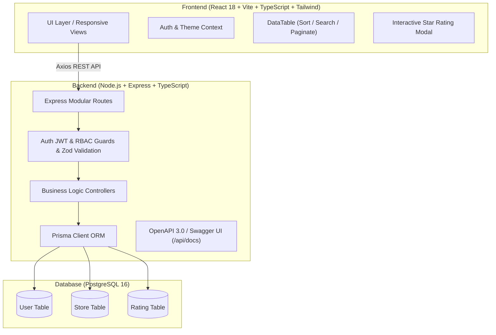
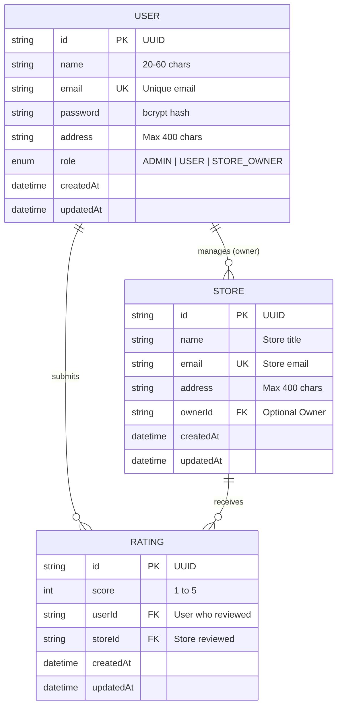

# 🌟 Roxiler Store Rating & Management Platform

[](https://github.com/mayur123marathe/store-rating-prototype/actions/workflows/ci.yml)


A production-grade, enterprise-ready fullstack web application allowing users to submit, view, and modify store ratings (1–5 stars), with role-based authentication and dashboards for **System Administrators**, **Store Owners**, and **Normal Users**.

> 📚 **Looking for Architecture, Request Flows & Viva/Interview Q&As?** Check out the comprehensive **[Architecture & Viva Guide (ARCHITECTURE_AND_VIVA_GUIDE.md)](./ARCHITECTURE_AND_VIVA_GUIDE.md)**!

Built to strictly satisfy all requirements of the **FullStack Coding Challenge** with top-tier engineering practices: TypeScript across the full stack, PostgreSQL with Prisma ORM, React with Vite & Tailwind CSS, Docker multi-stage containerization, interactive Recharts analytics, and OpenAPI 3.0 / Swagger documentation.

---

## 🚀 Key Highlights & Enhancements

- 🐳 **One-Command Dockerization**: Complete container orchestration (`docker-compose up --build`) running PostgreSQL, Node.js REST API with automatic schema migrations & seeders, and Nginx React frontend.
- ⚡ **1-Click Recruiter Demo Logins**: Instant credential-filling buttons on the login page for **Admin**, **Store Owner**, and **Normal User** with rich pre-seeded data.
- 📖 **Interactive Swagger / OpenAPI 3.0 Docs**: Live API explorer mounted at `http://localhost:5000/api/docs` with JWT Bearer authentication support.
- 📊 **Rich Interactive Analytics**:
  - **Admin**: Platform KPIs, store review totals, and Recharts 1–5 star rating distribution bar chart.
  - **Store Owner**: Store average score, review counts, 5-star to 1-star percentage progress bars, and full reviewer directory.
- 🛡️ **Real-Time Client & Server Form Validations**:
  - Name: **Min 20, Max 60 characters** (with live character counter in UI).
  - Address: **Max 400 characters** (with live length counter).
  - Password: **8–16 characters, 1+ uppercase letter, 1+ special character** (with live visual checklist).
  - Email: RFC 5322 compliant standard email validation.
  - Rating: Integer between 1 and 5 stars.
- 🗂️ **Advanced Data Tables**: Full-text search with debounce, multi-column sorting (ascending/descending), role filters, and pagination.
- 🌓 **Theme Engine**: Sleek Dark Mode & Light Mode with instant toggle and local storage persistence.
- 🧪 **Automated Test Suite**: Unit & integration test suites verifying validation schemas, JWT auth, and role-based access control.

---

## 🏛️ System Architecture



---

## 🗄️ Database Schema (Entity-Relationship)



> **Unique Constraint**: `Rating(userId, storeId)` ensures each user can submit exactly one rating per store, which they can modify anytime.

---

## 👥 Role Permissions & Feature Matrix

| Feature | System Administrator | Normal User | Store Owner |
| :--- | :---: | :---: | :---: |
| **Unified Login & Role Redirection** | ✅ | ✅ | ✅ |
| **Self Sign-Up (Registration)** | — | ✅ | — |
| **Change Own Password** | ✅ | ✅ | ✅ |
| **Dashboard Analytics & KPIs** | ✅ (Platform-wide) | — | ✅ (Store-specific) |
| **Add New Store** | ✅ | — | — |
| **Add New Users (Any Role)** | ✅ | — | — |
| **List & Filter All Users** | ✅ | — | — |
| **List Users' Store Rating (if Owner)** | ✅ | — | — |
| **Browse Stores Catalog** | ✅ | ✅ | ✅ |
| **Search Stores by Name & Address** | ✅ | ✅ | ✅ |
| **Sort Stores (Rating, Name, Date)** | ✅ | ✅ | ✅ |
| **Submit 1–5 Star Rating** | — | ✅ | — |
| **Modify Submitted Rating** | — | ✅ | — |
| **View Store Reviewers List** | — | — | ✅ |
| **Multi-Column Sorting on Tables** | ✅ | ✅ | ✅ |

---

## 🔑 Pre-Seeded Test Credentials

Use the **⚡ 1-Click Demo Buttons** on the login page, or manually test with the following credentials:

| Role | Email | Password | Display Name |
| :--- | :--- | :--- | :--- |
| **System Administrator** | `admin@roxiler.com` | `Admin@123` | System Administrator Roxiler Platform |
| **Store Owner** | `owner.tech@roxiler.com` | `Owner@123` | Marcus Aurelius Store Manager |
| **Store Owner** | `owner.fresh@roxiler.com` | `Owner@123` | Elena Rostova Grocery Director |
| **Store Owner** | `owner.cafe@roxiler.com` | `Owner@123` | Sebastian Michael Artisan Baker |
| **Normal User** | `user.alex@roxiler.com` | `User@123` | Alexander Hamilton Senior Reviewer |
| **Normal User** | `user.ben@roxiler.com` | `User@123` | Benjamin Franklin Certified Buyer |
| **Normal User** | `user.charlotte@roxiler.com` | `User@123` | Charlotte Bronte Verified Customer |

---

## 🐳 Quick Start with Docker (Recommended)

Start the entire stack (PostgreSQL + Backend API + Frontend Web App + Automatic Database Seeder) with a single command:

```bash
docker compose up --build
```

- **Frontend Application**: `http://localhost` (or `http://localhost:80`)
- **Backend REST API**: `http://localhost:5000/api`
- **Interactive Swagger Docs**: `http://localhost:5000/api/docs`

To stop the containers:
```bash
docker compose down
```

---

## 💻 Local Development Setup (Without Docker)

### Prerequisites
- Node.js `v20+` or `v22+`
- PostgreSQL instance running locally on port `5432`

### 1. Database Setup
Ensure PostgreSQL is running and create the database `roxiler_db` (or configure your `.env` connection string).

### 2. Backend Setup
```bash
cd backend
npm install
npx prisma db push
npm run prisma:seed
npm run dev
```
Backend will be live at `http://localhost:5000`.

### 3. Frontend Setup
```bash
cd frontend
npm install
npm run dev
```
Frontend will be live at `http://localhost:5173`.

---

## 🧪 Running Automated Tests

Run the test suite covering authentication, validation schemas, and role guards:

```bash
cd backend
npm test
```

---

## 📡 REST API Summary

| Method | Endpoint | Access | Description |
| :--- | :--- | :--- | :--- |
| `GET` | `/api/health` | Public | Service health check |
| `POST` | `/api/auth/signup` | Public | Register a new Normal User |
| `POST` | `/api/auth/login` | Public | Single unified login (returns JWT) |
| `POST` | `/api/auth/change-password` | Authenticated | Update user password |
| `GET` | `/api/auth/me` | Authenticated | Fetch current user profile |
| `GET` | `/api/admin/dashboard` | Admin Only | Platform-wide analytics & stats |
| `GET` | `/api/admin/users` | Admin Only | Filtered & sorted users list |
| `POST` | `/api/admin/users` | Admin Only | Create user with specified role |
| `GET` | `/api/admin/stores` | Admin Only | List all stores with overall ratings |
| `POST` | `/api/admin/stores` | Admin Only | Create new store & assign owner |
| `GET` | `/api/stores` | Public / User | Browse stores with user rating state |
| `GET` | `/api/stores/owner/dashboard` | Store Owner | Store rating & reviewer user list |
| `POST` | `/api/ratings` | Normal User | Submit or modify 1–5 star rating |

---

## 📝 Form Validation Constraints Reference

1. **Name**:
   - Minimum: `20` characters
   - Maximum: `60` characters
   - Client: Live character counter with warning indicator
   - Server: Strict Zod validation returning 400 with field message
2. **Address**:
   - Maximum: `400` characters
   - Client: Real-time length indicator
   - Server: Zod string max(400)
3. **Password**:
   - Length: `8` to `16` characters
   - Uppercase: At least `1` uppercase letter `[A-Z]`
   - Special Character: At least `1` special character `[!@#$%^&*...]`
   - Client: Live interactive visual rule checklist
   - Server: Strict Regex & bcrypt hashing with salt rounds = 10
4. **Email**:
   - Standard RFC 5322 email regex validation
5. **Rating**:
   - Integer between `1` and `5`
